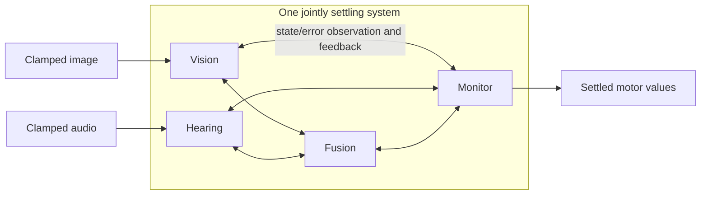

# Flat, deep and recursively observing brains

Cadence builds **processing populations and recursive observers in one jointly
settling graph**. Population size is explicit. Sensory data, ordinary
representation connections and observation of internal activity have distinct
roles. Each patch has live state, incoming ports, exact prediction-error
readback and retained local relation parameters. Feedback repairs one coupled
state. The same `Cortex` builder and `Brain` learning/query interface serve
all three layouts. Start with the [quickstart](QUICKSTART.md), then use
[brain design](BRAIN_DESIGN.md) for input, capacity and learning choices.

## Choose observation depth deliberately

| Layout | Construction | What changes |
| --- | --- | --- |
| Flat | `column(..., inputs=sensors)` | Each output patch directly models its sensory inputs; adjacent unused patches add no hidden capacity. |
| Ordinary deep | `column(..., inputs=earlier_population)` | Learned intermediate representations participate in one coupled solve, with returning influence through the energy. |
| Recursive observer | `observer(..., observes=earlier_population)` | Adds exact current prediction-error inputs alongside the observed states. Observers can themselves be observed. |

All use the same patch law and qualification check; recursion is optional
wiring. The [layout guide](VARIANTS.md) provides a runnable construction of
each, and [layout_learning.py](../examples/layout_learning.py) teaches and
tests them through the same interface.

From the [tagged source checkout](../examples/README.md#get-the-example-sources):

```sh
PYTHONPATH=src python examples/layout_learning.py --layout all
```

Input-only fixed-parameter queries have a separable state objective; coupling
adds dependencies to joint repair. Recursive depth adds state-and-error
constraints, but does not guarantee
better reasoning or a particular increase in elapsed time. Start with the
smallest useful layout and measure task quality, settling work and complete
command latency. The [performance guide](PERFORMANCE.md) explains the
closed-form flat case, the older fast browser demos and controlled comparisons.

**System 1** describes an acquired routine that works with little repair; it
can require ordinary deep representations. **System 2** describes additional
recursive correction that usefully repairs a failing routine or unmet goal.
These are behavioral roles, not layout names. Current `0.60.0` supports
the wiring and whole-brain repair described here, but automatic internal
attention, independently progressing populations and the integrated
routine/correction cycle remain unimplemented. Historical demo results belong
to their recorded models and runtimes; see
[versioned reproduction](MIGRATION_060.md#reproduce-the-website-demos-before-optimizing-them).

## Build the layout

```python
from cadence import Cortex

cortex = Cortex(seed=7)
eyes = cortex.input("eyes", shape=(8, 8))
ears = cortex.input("ears", shape=(2, 16))
body = cortex.input("sensory_nerves", shape=(8,))
senses = (eyes, ears, body)

c1 = cortex.column("perception", patches=16, inputs=senses)
c2 = cortex.observer(
    "integration", patches=8, inputs=senses, observes=(c1,),
)
c3 = cortex.observer(
    "reflection", patches=8, inputs=senses, observes=(c1, c2),
)
motors = cortex.output("motor_nerves", shape=(8,), reads=c3)
brain = cortex.build()

layout = brain.inspect()
assert layout["patches"] == 32
assert layout["input_samples"] == 104
assert layout["sensor_coverage"] == 104
```

The small shapes and populations bound this layout example. A camera can declare
`shape=(240, 320, 3)`, but dense connections then exceed the default connection
budget. Choose a representation and wiring budget explicitly; see
[connectivity and cost](VARIANTS.md#connectivity-and-cost).
Shape does not provide a learned visual interpretation, and pixel
samples are not processing patches. Eight output values expose eight selected
patch states. There is no separate policy network after settlement.

## Parallel processing and recursive observation

Use `inputs` for sensor samples or represented data. For example, vision and
hearing can form parallel branches before a fusion population:

```python
parallel = Cortex(seed=3)
image = parallel.input("image", shape=(4, 4))
audio = parallel.input("audio", shape=(4,))
vision = parallel.column("vision", patches=8, inputs=image)
hearing = parallel.column("hearing", patches=8, inputs=audio)
fusion = parallel.column("fusion", patches=8, inputs=(vision, hearing))
monitor = parallel.observer(
    "monitor", patches=4, observes=(vision, hearing, fusion),
)
parallel.output("move", shape=(2,), reads=monitor)
parallel_brain = parallel.build()

result = parallel_brain.settle({"image": [0.2] * 16, "audio": [0.1] * 4})
assert result["qualified"]
print(result["outputs"]["move"])
```

`observes` connects both **live patch states and their exact current prediction
errors**. Its constraints send feedback into the states it observes through
the same energy. A higher observer can include `monitor` in its scope.
`column` and `observer` use the same processing-patch law; their distinction
is their connections. An observer can also receive ordinary `inputs`.
Ordinary state contacts already return influence through joint repair;
observation adds an error channel rather than introducing feedback for the
first time. That channel is the current mismatch, recomputed as states change.
It is not a stored comparison between a previously issued forecast and its
later outcome. Preserve those original forecasts and actual outcomes at the
body boundary when assessing surprise or useful correction.



The inspector's edges describe read dependencies. Returning influence is
computed from the energy derivatives at those same connections. The diagram's
two-way connections describe that influence; they do not imply a second,
independently learned reverse edge. Raw sensory samples stay fixed throughout
a solve. Feedback changes internal interpretations, not the supplied samples.

Parallel branches need no arbitrary sequencing as completed neural answers.
Each repair considers the current complete state. Every participating
population remains in the energy, and final qualification checks every eligible
free coordinate. The default Python engine uses a synchronized reference
schedule. Optional tensor execution parallelizes eligible arithmetic on CPU or GPU while retaining
the same coupled objective and final numerical check; see
[acceleration](ACCELERATION.md). Independent brains can also run in separate
processes. Neither kind of parallelism chains completed population answers.

## What a processing patch computes

Patch `i` owns live state `x_i` and retained local relation parameters `w_i, b_i`.
Its incoming signals are sensor samples, other live states, or observed errors:

```text
p_i = tanh(b_i + sum_j w_ij * signal_j)
e_i = x_i - p_i

E = 1/2 sum_i e_i² + state_prior/2 sum_i x_i²
```

Prediction `p_i` and error `e_i` are recomputed exactly. They are not separately
adjustable reports that could hide a disagreement. The public builder accepts
only previously declared source populations, so **both state and error-reading
connections are acyclic**. All their eligible states settle together. Returning
energy derivatives let a later population influence an earlier one; this is
different from an independently learned reverse state connection. The private
numerical kernel supports recurrent state contacts, but the public layout does
not expose them.

The positive `state_prior` is part of this model, not just a numerical setting.
In the idealized zero-penalty limit, an unclamped layered query with fixed
parameters and state bounds at least one has a unique stationary solution:
forward substitution with every prediction error zero. Zero penalty is not a
supported configuration. At positive penalty, or with output/intervention
clamps, returning constraints can change earlier states. Joint settlement alone
does not establish recurrent working memory or a useful recursive-depth effect.

Repair uses the analytic derivatives of this energy with respect to eligible
coordinates, projected into bounded boxes. Derivatives include the effects of
observed errors on their observers. Backtracking requires sufficient energy
decrease, with a bounded rounding allowance only for an already stationary
final proposal ([exact rule](SPECIFICATION.md#repair-and-qualification)).
There is one repair procedure
for live-state queries and experience admission; admission also makes relation
parameters eligible and adds the fixed anchoring term below.

This reference engine uses derivatives and a global energy acceptance check.
It does not establish a gradient-free algorithm or asynchronous distributed
confluence. Nonlinear energy can have multiple stationary points; different
initial states need not produce identical answers. The full projected
stationarity test may refuse when its budget is exhausted.

**Stationarity and prediction error are different measurements.** A qualified
compromise can retain nonzero prediction errors. `stationarity` checks whether
any allowed repair direction remains larger than the tolerance;
`prediction_residual` reports the largest absolute prediction error. Neither
number is a task accuracy score.

## Bootstrapping and live experience

The **bootstrapping phase** prepares a brain with representative experiences
and checks its subsequent unclamped answers. The **live phase** runs that
persistent brain with current inputs and can continue learning from actual
outcomes. These are application lifecycle phases, using the same patch law and
repair procedure. Entering the live phase does not automatically freeze
parameters or enable a different solver: the application chooses when to query,
retain activity with `step`, or admit witnesses with `observe`.

`observe` clamps supplied output targets and jointly repairs live state and
local relation parameters. A proximal prior anchors the parameters to their
values immediately before this experience:

```text
E_learning = E + parameter_prior/2 * ||parameters - previous_parameters||²
```

The anchor remains fixed throughout this solve. A qualified proposal commits
its state, parameters and event identity atomically. A refused proposal commits
nothing. By default, targets are labeled `source="witness"`; derived teaching
values require `source="estimate"`. The equation is the same, and the source
label is caller-supplied provenance bound into the admission identity.
`Reinforcement` uses this interface for discrete-action Q-learning with
one-step reward credit by default and bounded replay. It does not make episodic retrieval,
imagination policies or structural growth automatic.

`observe_batch` groups labeled experiences under one shared set of parameters.
Every example has private activity initialized from the same retained live
state. Its processing and observing populations remain in the joint repair;
the objective averages example energies and charges the parameter anchor once.
A qualified batch retains shared parameters and one event identity, preserving
live state. Grouping changes learning compared with serial admissions and
creates no implicit temporal connections. Use `bootstrap(..., batch_size=...)`
for bounded replay through this interface; see [batch experience](REFERENCE.md#batch-experience).

Retained relation parameters provide durable but plastic learned information;
later learning can overwrite it. Replay helps revisit experiences but does not
provide protected consolidation. `History` instead supplies a bounded explicit
window of caller-provided observations, with presence masks. It can expose
motion or a recently occluded object without claiming that the brain learned
recurrent memory. `LearningProgress` tracks reductions in supplied predictor
error; noisy decreases can also raise it, so it is neither information gain nor
a settlement residual. See [live learning](LIVE.md) for composing these helpers.

```python
teacher_layout = Cortex(seed=2)
signal = teacher_layout.input("signal", shape=(1,))
base = teacher_layout.column("base", patches=4, inputs=signal)
reflection = teacher_layout.observer(
    "reflection", patches=2, inputs=signal, observes=base,
)
teacher_layout.output("answer", shape=(1,), reads=reflection)
learner = teacher_layout.build()

for event_id in range(40):
    value = (-0.8, 0.8)[event_id % 2]
    update = learner.observe(
        {"signal": [value]}, {"answer": [value]}, event_id=event_id,
    )
    assert update["accepted"]

# No target clamps here: these amplitudes were absent from teaching.
assert learner.predict({"signal": [-0.4]})["answer"][0] < -0.2
assert learner.predict({"signal": [0.4]})["answer"][0] > 0.2
```

Outputs fixed to supplied witnesses equal their targets by construction, so
reporting them as learning accuracy would be invalid. Tests instead check
subsequent **unclamped predictions**, new inputs and controls without admission
or sensory access.
This tiny example demonstrates acquisition of an input-dependent relation;
it is not evidence that the observer improves it over a simpler model.

For a body-driven example, run
`PYTHONPATH=src python examples/live_control.py --decisions 20 --seed 0`.
It acquires a next-position model, uses it to compare candidate actions and
admits actual executed transitions. The application supplies that action
search and task score; see the [example guide](../examples/README.md#use-an-acquired-model-to-control-a-body)
for interpreting its behavioral and qualification checks.

## Recursive depth and future time

An observer reads the current joint state and prediction errors. Nesting another
observer increases observation depth; it does not automatically add another
future time step. For imagination, first bootstrap relations between a current
situation, an action and its consequences. Querying those relations with
alternative actions can then predict possible outcomes. `settle` supports pure
hypothetical clamps, so these queries need not change the live brain or admit
imagined events as experience.

Planning additionally needs a goal and a way to compare or jointly constrain
possible action sequences. A loop that searches alternatives outside the brain
is an application planner. A candidate for planning inside one equilibrium must
represent actions and future states within that equilibrium, with any observers
reading and influencing those same states. Both require behavioral tests:
successful settlement and a greater observer count do not establish useful
future prediction or planning. Keep horizon, recursive depth, width and total
repair work separate in comparisons.

## Configure and inspect

The [API reference](REFERENCE.md) documents every constructor parameter, method,
result field and shape rule. `brain.inspect()` reports exact patch, input and
connection counts, sensor coverage and observation roles. `brain.config` is
read-only. `Cortex(device="mps")`, `Cortex(device="cuda")` or
`Cortex(device="cpu")` selects optional tensor execution; the default is
`device="python"`. Width, depth and sparse wiring all change resource cost; see
[layout variants](VARIANTS.md) and [bootstrapping and size](BOOTSTRAP.md).

`brain.settle(inputs)` is a pure query; `brain.step(inputs)` retains qualified
live state with parameters frozen. Both accept optional `targets` and
`interventions` to condition the solve. For `step`, the resulting activity is
retained but the clamps are not carried into later calls. This adds no teaching
evidence: a goal-clamped future value is not a prediction of the outcome.
`brain.observe(inputs, targets)` also permits
relation changes from labeled targets. Check `qualified` or `accepted` before
using a result. `brain.predict(inputs)` raises `SettlementError` on refusal.
Serialize calls to each brain; there is no concurrent mutation contract.
`observe_batch` is one atomic admission, not permission to mutate the same brain
concurrently. Tensor execution can parallelize its private experience rows.

## Continuation and tests

```python
from cadence import Brain

saved = learner.snapshot()
restored = Brain.from_snapshot(saved)
assert restored.snapshot() == saved
assert restored.predict({"signal": [0.4]}) == learner.predict({"signal": [0.4]})
```

Checkpoints bind the complete configuration, graph identity and the exact
layout, repair, tensor and validation source hashes.
`Brain.from_snapshot(saved, device="python")` explicitly transfers a compatible
continuation to the reference engine while preserving its arrays and admission
cursor. Device selection changes configuration identity; see
[checkpoint transfer](ACCELERATION.md#move-a-continuation-between-devices). Loading requires these sources to
match exactly, including across releases. A checkpoint is a continuation record,
not proof that its witnesses came from a real environment. Queries and
hypothetical interventions do not add witnesses. Restore validates the entire
proposal before replacing a live brain.

Run the focused tests and executable documentation with:

```sh
python -m pytest -q tests/test_drsn.py tests/test_drsn_math.py tests/test_documentation.py
```

The suite covers parallel and nested layouts, multimodal shapes, exact patch
counts, sparse source coverage, live-error derivatives, reciprocal intervention,
energy descent, bounded stationary solutions, refusal, actual acquisition,
event custody, configuration and checkpoint validation. Finite differences
check derivatives through recursive error readback and, in the private numerical
kernel, recurrent state contacts.
Larger application results and advantages over competing architectures require
separate controlled tests.
