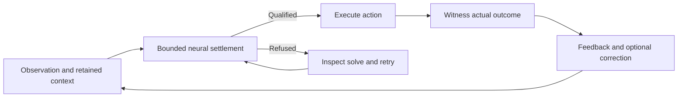

# Cadence documentation: build a continuing brain

**We are building an animal brain.** Cadence is not a classifier, not any traditional naive
neural network, not an MLP, and not a transformer with an attention matrix that scales badly
with context. **Cadence is a continuing equilibrium world-model brain.** Its working hypothesis
is that a settled interpretation is the world model in operation. Learned
relationships and retained memories support a family of such interpretations
across situations. Start with [the world-model guide](world-model.md), then run
the [quickstart](quickstart.md) and [continuing example](../examples/continuing_brain.py).

These guides use Cadence 0.80.0. Install it with
`python -m pip install cadence-net==0.80.0`; contributors can install the checkout
with `python -m pip install -e .` from the repository root.
The [index](index.md) is the catalogue; this page gives a reading order.

## Start here

1. Read [one continuing equilibrium brain](world-model.md) for the design:
   bootstrap, use, witness a failure, repair and continue the same acquired brain.
2. Run the [quickstart](quickstart.md), then
   [examples/continuing_brain.py](../examples/continuing_brain.py). The latter
   records actual outcomes, correction, settling work and saved continuation.
3. Use [composition](brain.md) and [continuous interaction](continuous.md) to
   connect your own environment. Declare what the brain observes, what its
   actions do, and when the body reports each outcome.
4. Read [contracts](contracts.md) before changing a solver or learning rule,
   and [task design](task-design.md) before claiming acquired behavior.

Agents working in this repository must also read [AGENTS.md](../AGENTS.md) and
[CONTRIBUTING.md](../CONTRIBUTING.md). They identify the construction rules,
capabilities to preserve and checks to run. Use the [API reference](api.md) for
exact signatures, defaults, mutation and refusal behavior.

## Choose the interface for the task

| You want to… | Start with | Read next |
| --- | --- | --- |
| Run one memory-using brain through real observations and actions | `Brain.compose(..., arousal=True)`, then `brain.live(...)` | [Quickstart](quickstart.md), [continuous interaction](continuous.md), [memory](memory.md) |
| Adjust a continuing brain's settings without replacing its state | `brain.retune(...)`, `brain.describe()` | [Defaults, rate ownership and application choices](brain.md#defaults-and-expert-overrides) |
| Declare custom neural regions and reciprocal projections | `Genome`, `develop`, `NeuralGraph`; optional `Brain` wrapper | [Composition](brain.md), [cortices](cortex.md), [connectomes](connectomes.md) |
| Study explicit reciprocal patches and optional recursive observation | `PatchNet` | [PatchNet](patchnet.md), [recursive settlement](recursive-settlement.md), [recursive training](recursive-training.md) |
| Learn environmental transitions and plan actions through them | `TemporalPatchNet`, `TemporalMemory` | [Interaction](interaction.md), [planning](planning.md), [response protection](temporal-memory.md) |
| Store witnessed events and consolidate them through dreams | `RecordPatchNet.observe`, `dream` and `sleep` | [Record-patch acquisition](record-patch.md#acquisition-in-two-phases-records-by-day-weights-by-night), [API](api.md#recordpatchnet-cadencerecord_patch) |
| Explore belief assimilation, steering and selective activity | `BeliefPatch`, `Steered`, `Life` | [Belief](belief.md), [steering](steering.md), [habit/imagination/learning](howto-rung.md) |
| Study exact state-and-error readback under its own equations | `cadence.experimental.equilibrium` | [Advanced population guide](equilibrium/index.md) |

`Brain.compose` constructs the brain; `live` advances its one continuing life.
`last_settlement` only reports diagnostics. Use `step` when you explicitly need
batched streams, teacher labels or learning from every outcome. The other rows expose
specialist mechanisms with distinct state and learning contracts; importing two
classes does not automatically integrate them into one equilibrium.

In particular, record-patch **sleep and dreaming remain supported**. `dream`
completes supplied cues from the retained model and records. `sleep` fixes those
targets, teaches the slow weights, then rewrites the store's residuals. This is
different from the composed brain's private `imagine` calls and online
`SynapticMemory` consolidation; the sleep cycle is not wired into `Brain.compose`.

## Keep one continuing life

Keep learned relations and relevant memory across this loop, and save pending
feedback when pausing. `live` consumes the preceding action's outcome before
settling the current observation. If that next solve refuses after accepting the
feedback, retry `live(observations)` without submitting the outcome again. The
[interaction guide](continuous.md#routine-and-repair-live) explains both retry cases.

## Recognize the intended lifecycle

A useful application makes these six things inspectable:

1. **Boundaries and state.** Declare observations, actions, stream identities and
   the context carried between events. A window can be a declared memory
   boundary; it does not by itself demonstrate continuing acquired knowledge.
2. **Reciprocal interpretation.** Let returning constraints participate in the
   same answer. `Brain.compose` already couples processing and motor regions
   reciprocally, even with one processing region and no optional observers.
   Sensory drive enters one way; default processing regions have no internal
   synapses. The recurrent solve, not the number of layers, distinguishes it
   from a feed-forward computation.
3. **Retained knowledge.** Reuse learned parameters, working trace and associative
   memory across experience. Independent `predict` omits both memory reads
   without erasing them; `fit` clears pending stream state. Those are component
   controls, not a substitute for testing the continuing brain.
4. **Witnessed correction.** Score issued actions or saved predictions against
   actual outcomes. `Brain` retains pending action and reward-value information;
   it does not yet generate an integrated environmental transition forecast.
   Supplied teachers label the current observation, while rewards concern the
   preceding action. Every actual outcome is consumed once, including success.
5. **Measured work.** Inspect `last_settlement` alongside task outcomes and
   learning reports. Free-answer sweeps and residuals are not total work or
   physical energy. Cheap routine behavior is a target to test.
6. **Continuation and retention.** Disturb the environment, measure recovery and
   old skills, and resume a saved brain with its pending feedback. A successful
   numerical solve alone establishes none of those behavioral results.

These are bounded, observer-like software systems: the composed brain exposes
neural state and sensory/motor indices, reads a working `Trace` and
`SynapticMemory`, and changes local relationships through feedback. Explicit
record-field ports and exact state-and-error readback belong to other APIs with
their own contracts. Optional System 2 observers extend System 1's existing
recurrence; they are not required for this lifecycle.

## Implemented mechanisms and current boundaries

| Mechanism | What to use and what it establishes |
| --- | --- |
| Continuing action, memory and saved feedback | [Brain](brain.md), [continuous interaction](continuous.md) and [memory](memory.md); a qualified neural state uses held trace and memory inputs. |
| Action settling diagnostics | `Brain.last_settlement` reports accepted and refused free-answer solves. [Full recording](api.md#record-every-settling-step) can capture additional solver calls; it incurs overhead. |
| Local teaching and reward updates | [Learning](learning.md) and [reward](reward.md); supplied labels and real feedback retain their distinct contracts. Centered dopamine can suppress actor modulation, not all learning or work. |
| Routine and repair in one life | `Brain.live` uses arousal to choose between greedy routine and exploration with learning; see [continuous interaction](continuous.md#routine-and-repair-live). Routine still pays a full settle. |
| Dreaming and sleep consolidation | [Record-patch sleep](record-patch.md#acquisition-in-two-phases-records-by-day-weights-by-night) transfers retained completions into slow weights. [Behavioral tests](../tests/test_record_patch.py) check recall after removing the record store; sleep does not guarantee correction of false memories. |
| Selective activity in a separate composition | [Life](api.md#life-cadencelife) governs a belief/steering model with an application-supplied habit. It is not an automatic gate inside `Brain.compose`. |
| Learned environmental consequences | [Temporal planning](planning.md), [record patches](record-patch.md) and [belief models](belief.md); integration into the default continuing brain is tracked in [the consequence-model issue](https://github.com/muellerberndt/cadence/issues/93). |
| Reliable cheap routine and selective repair | A measured research target. [The repair issue](https://github.com/muellerberndt/cadence/issues/122) owns the missing integrated contract; neither small residual nor successful reward proves it. |

## Read in order

| Stage | Guides |
| --- | --- |
| Understand the hypothesis | [World-model lifecycle](world-model.md), [equilibrium world models](equilibrium-world-models.md), [architecture](architecture.md), [orientation for ML readers](orientation.md) |
| Run a continuing brain | [Quickstart](quickstart.md), [composition](brain.md), [continuous interaction](continuous.md), [experience design](experience.md), [memory](memory.md), [reward](reward.md) |
| Understand and test local updates | [Concepts](concepts.md), [learning](learning.md), [task controls](tasks.md), [arrays and component controls](build.md) |
| Evaluate a whole life | [Task design](task-design.md), [sequential tasks and prerequisite chains](sequential-tasks.md), [missteps](missteps.md), [scaling](scaling.md), [troubleshooting](troubleshooting.md), [creativity](creativity.md) |
| Check numerical and evidence contracts | [Contracts](contracts.md), [certificates](certificate.md), [protocols](protocols.md), [receipts](receipts.md), [API](api.md), [backends](backends.md) |
| Study learned consequences and records | [Interaction](interaction.md), [temporal models](temporal.md), [planning](planning.md), [response protection](temporal-memory.md), [record patches](record-patch.md), [belief](belief.md), [steering](steering.md), [habit/imagination/learning](howto-rung.md) |
| Build custom reciprocal graphs | [PatchNet](patchnet.md), [recursive settlement](recursive-settlement.md), [recursive training](recursive-training.md), [cortices](cortex.md), [genomes](evolution.md), [connectomes](connectomes.md), [partitioned settling](partitioned.md) |
| Explore execution and visualization | [Population execution](population.md), [viewer pages](pages.md), [advanced state-and-error solver](equilibrium/index.md) |

Use each model family's own mathematics and tests. A guarantee about the
population solver, temporal model or record store does not certify the composed
neural graph without a demonstrated correspondence.

For verification commands and package checks, use [CONTRIBUTING.md](../CONTRIBUTING.md).
For a result, preserve its task, source revision, seeds, outcome measurements and
full work accounting through [protocols](protocols.md) and [receipts](receipts.md).
Passing numerical tests is useful evidence; performance claims also need matched
behavioral and resource comparisons.
